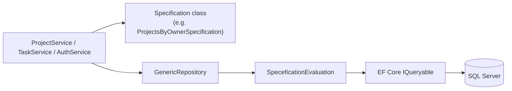

# Task Management API

A .NET 8 Web API for managing **projects** and **tasks** with JWT authentication. The solution is organized as a layered application that demonstrates enterprise patterns: clean architecture, dependency injection, SOLID, DTOs, global exception handling, validation, specification pattern, structured logging, and more.

---

## Live demo (hosted for testing)

This project is **published online** on [MonsterASP.NET](https://www.monsterasp.net/) so you can test the API without running it locally.

| Resource | Link |
|----------|------|
| **Swagger UI (try the API)** | [http://taskmanagementapielectropiasessment.runasp.net/swagger/index.html](http://taskmanagementapielectropiasessment.runasp.net/swagger/index.html) |
| **API root** | [http://taskmanagementapielectropiasessment.runasp.net/](http://taskmanagementapielectropiasessment.runasp.net/) (redirects to Swagger) |
| **Health check** | [http://taskmanagementapielectropiasessment.runasp.net/health](http://taskmanagementapielectropiasessment.runasp.net/health) |
| **OpenAPI JSON** | [http://taskmanagementapielectropiasessment.runasp.net/swagger/v1/swagger.json](http://taskmanagementapielectropiasessment.runasp.net/swagger/v1/swagger.json) |

### Quick test flow (Swagger)

1. Open **[Swagger UI](http://taskmanagementapielectropiasessment.runasp.net/swagger/index.html)**.
2. `POST /api/Auth/Register` — create a test user (or use `POST /api/Auth/Login` if you already registered).
3. Copy `accessToken` from the login response.
4. Click **Authorize** → enter: `Bearer {your-access-token}`.
5. Call `GET /api/Project`, `POST /api/Project`, `GET /api/Task/project/{projectId}`, etc.

---

## Production database connection

The hosted API uses this **SQL Server** database on MonsterASP (also in `Chatty/appsettings.Production.json`):

```json
"ConnectionStrings": {
  "DefaultConnection": "Server=db53352.databaseasp.net; Database=db53352; User Id=db53352; Password=7d_Y-6Xc5Wr!; Encrypt=False; MultipleActiveResultSets=True;"
}
```

| Setting | Value |
|---------|--------|
| **Server** | `db53352.databaseasp.net` |
| **Database** | `db53352` |
| **User Id** | `db53352` |
| **Password** | `7d_Y-6Xc5Wr!` |
| **Encrypt** | `False` |
| **MultipleActiveResultSets** | `True` |

**Full ADO.NET / EF connection string (one line):**

```
Server=db53352.databaseasp.net; Database=db53352; User Id=db53352; Password=7d_Y-6Xc5Wr!; Encrypt=False; MultipleActiveResultSets=True;
```

Use this string in **SSMS**, **Azure Data Studio**, or `dotnet ef` when applying migrations to the same database as production.

> **Note:** Credentials are included here for demo and course/testing access. For a real production app, store secrets in environment variables or the hosting control panel, not in public documentation.

---

## Database migrations (initialize a new database)

Migrations live in `Presistence/Migrations/`. Use them to create or update schema on a **new** SQL Server database (local or MonsterASP).

### Option 1 — Automatic on startup (hosted site)

Production config enables:

```json
"Database": { "ApplyMigrationsOnStartup": true }
```

When the API starts, it runs `MigrateAsync()` and creates/updates tables (`AspNetUsers`, `Projects`, `Tasks`, `RefreshTokens`, etc.).

### Option 2 — Manual from your machine (recommended for new DB)

**Prerequisites:** [.NET 8 SDK](https://dotnet.microsoft.com/download/dotnet/8.0), EF Core tools:

```bash
dotnet tool install --global dotnet-ef
```

**Apply all migrations** (local SQL Server example):

```bash
cd Presistence
dotnet ef database update --startup-project ../Chatty
```

**Apply migrations to the hosted MonsterASP database** (paste the production connection string):

```bash
cd Presistence
dotnet ef database update --startup-project ../Chatty --connection "Server=db53352.databaseasp.net; Database=db53352; User Id=db53352; Password=7d_Y-6Xc5Wr!; Encrypt=False; MultipleActiveResultSets=True;"
```

### Option 3 — Create a new migration (after model changes)

```bash
cd Presistence
dotnet ef migrations add YourMigrationName --startup-project ../Chatty
dotnet ef database update --startup-project ../Chatty
```

### Tables created by migrations

| Table | Purpose |
|-------|---------|
| `AspNetUsers`, `AspNetRoles`, … | Identity (login/register) |
| `Projects` | User-owned projects |
| `Tasks` | Tasks linked to projects |
| `RefreshTokens` | JWT refresh tokens |

### Optional sample data

After migrations and at least one registered user, run:

`Presistence/Scripts/SeedProjectsAndTasks.sql`

See [Presistence/Scripts/README.md](Presistence/Scripts/README.md).

---

## Table of contents

- [Live demo (hosted for testing)](#live-demo-hosted-for-testing)
- [Production database connection](#production-database-connection)
- [Database migrations (initialize a new database)](#database-migrations-initialize-a-new-database)
- [Architecture Requirements](#architecture-requirements)
- [Additional Requirements & Patterns](#additional-requirements--patterns)
- [Solution structure](#solution-structure)
- [Features](#features)
- [API endpoints](#api-endpoints)
- [Architecture deep dive](#architecture-deep-dive)
- [Specification pattern (detailed)](#specification-pattern-detailed)
- [Logging (detailed)](#logging-detailed)
- [Additional features (detailed)](#additional-features-detailed)
- [Getting started (local development)](#getting-started-local-development)
- [Hosting on MonsterASP.NET](#hosting-on-monsteraspnetnet)
- [Tech stack](#tech-stack)

## Architecture Requirements

The project demonstrates the following architectural and design practices:

| Requirement | How it is implemented in this project |
|-------------|----------------------------------------|
| **Clean Architecture** | Layers depend inward: **Domain** (entities, contracts, exceptions) has no infrastructure references; **Service** implements business logic; **Presistence** handles EF Core and repositories; **Presentation** exposes HTTP APIs; **Chatty** (`TaskManagementApi`) is the composition root that wires everything together. |
| **Dependency Injection** | Services are registered in extension methods (`AddPresistenceConfig`, `AddServiceConfiguration`) and consumed via constructor injection in controllers and services. ASP.NET Core Identity and JWT authentication are also registered in `Program.cs`. |
| **SOLID Principles** | **S**ingle responsibility per layer (e.g. `ProjectService` for project rules, `GenericRepository` for data access). **O**pen/closed via specifications and interfaces. **L**iskov through `BaseEntity<T>` and generic repositories. **I**nterface segregation (`IProjectService`, `ITaskService`, `IAuthService`, `IUnitOfWork`). **D**ependency inversion: high-level code depends on abstractions in `Domain` and `ServiceAbstraction`, not concrete persistence. |
| **DTO Usage** | Request/response models live in **SharedData/DTOs** (e.g. `CreateProjectDTO`, `TaskResultDTO`). AutoMapper profiles map between DTOs and domain entities so controllers and clients never depend on persistence models directly. |
| **Global Exception Handling** | `CustomExceptionMiddleware` catches unhandled exceptions, maps domain exceptions (`NotFoundException`, `BadRequestException`) to HTTP status codes, and returns a consistent `ErrorModel` JSON payload. |
| **Validation** | Data annotations on DTOs (`[Required]`, `[MaxLength]`, `[Compare]`) plus `ModelState` checks in controllers return structured `ApiResponse` validation errors before business logic runs. |

## Additional Requirements & Patterns

Beyond the core architecture requirements, the project also demonstrates these patterns and capabilities:

| Requirement / Pattern | How it is implemented in this project |
|-----------------------|----------------------------------------|
| **Specification Pattern** | Query logic is encapsulated in specification classes (`ProjectsByOwnerSpecification`, `TaskByIdAndOwnerSpecification`, etc.) that implement `ISpecification<T, TK>`. The persistence layer applies them via `SpeceficationEvaluation.ApplySpecefication` before EF Core executes the query. |
| **Repository Pattern** | `IGenaricRepository<T, TK>` and `GenericRepository<T, TK>` provide generic CRUD and specification-based reads without leaking EF Core into the service layer. |
| **Unit of Work Pattern** | `IUnitOfWork` manages a shared `ApplicationDbContext`, caches repository instances per entity type, and exposes `SaveChangesAsync` for transactional commits. |
| **Structured Logging** | **Serilog** writes to console and rolling JSON log files; **ILoggingService** wraps `ILogger<T>` with `LogOperationAsync` for timed business operations. |
| **AutoMapper** | Profiles in `Service/Auto_Mapper_Profile` map DTOs ↔ domain entities so services stay focused on rules, not manual property copying. |
| **Uniform API Response** | `ApiResponse<T>` standardizes success/failure shape (`Success`, `Message`, `Data`, `Errors`) across all controllers. |
| **JWT Authentication** | Access tokens issued on login; refresh tokens stored in the database and validated via specifications. |
| **User-Scoped Data Access** | Projects and tasks are filtered by the authenticated user's `OwnerId` using specifications — users cannot access another user's resources. |
| **EF Core Fluent Configuration** | Entity rules (keys, relationships, constraints) live in `Presistence/Data/Configuration` instead of attributes on domain entities. |
| **Domain Exceptions** | `NotFoundException` and `BadRequestException` in the Domain layer express business failures that middleware maps to HTTP responses. |

---

## Solution structure

```
TaskManegment/
├── Chatty/                    # Web host (TaskManagementApi) — Program.cs, middleware, Serilog
├── Domain/                    # Entities, repository contracts, specifications, domain exceptions
├── Service/                   # Business services, AutoMapper, specification implementations
├── ServiceAbstraction/        # Service interfaces (IProjectService, ITaskService, IAuthService, …)
├── Presistence/               # EF Core DbContext, migrations, GenericRepository, Unit of Work
├── Presentation/              # API controllers
└── SharedData/                # DTOs, enums, ApiResponse wrapper, constants
```

### Layer dependencies

```
Presentation  →  ServiceAbstraction, SharedData
Service       →  Domain, ServiceAbstraction, SharedData
Presistence   →  Domain
Chatty        →  Presentation, Presistence, Service
Domain        →  (no project references to outer layers)
```

---

## Features

### Authentication & authorization

- **Register** — Create users with ASP.NET Core Identity (`ApplicationUser`).
- **Login** — Email/password sign-in; returns JWT access token.
- **Refresh token** — Rotate access tokens using a stored refresh token.
- **JWT Bearer** — Protected project and task endpoints require a valid token (`[Authorize]` on `ProjectController` and `TaskController`).

### Project management

- Create, read, update, and delete projects.
- Projects are scoped to the authenticated user (`OwnerId`).
- Fields: name, description, created date.

### Task management

- Create tasks under a project (title, description, status, due date, priority).
- Update task status.
- List tasks by project.
- Delete tasks.
- Ownership enforced via specifications (user must own the project).

### Data access patterns

See [Specification pattern (detailed)](#specification-pattern-detailed), [Repository pattern](#repository-pattern), and [Unit of Work pattern](#unit-of-work-pattern) for full explanations.

- **Repository pattern** — Generic CRUD + specification-based queries.
- **Unit of Work** — Single `DbContext` and `SaveChangesAsync` per request.
- **Specification pattern** — Reusable, composable query objects (7 specifications in the solution).
- **Entity Framework Core** — SQL Server with fluent entity configurations.

### Cross-cutting concerns

See [Logging (detailed)](#logging-detailed) and [Additional features (detailed)](#additional-features-detailed).

- **Serilog** — Console + rolling JSON log files; HTTP request logging.
- **ILoggingService** — Timed business operations via `LogOperationAsync`.
- **ApiResponse wrapper** — Consistent API contract for all endpoints.
- **AutoMapper** — DTO ↔ entity mapping profiles.
- **CORS & Swagger** — Dev-friendly API exploration and frontend integration.

### Domain model

| Entity | Purpose |
|--------|---------|
| `ApplicationUser` | Identity user (auth) |
| `RefreshToken` | JWT refresh token storage |
| `Project` | Container for tasks; owned by a user |
| `TaskItem` | Task with status, priority, due date, project link |

### Task status & priority

- **Status:** `Pending`, `InProgress`, `Completed` (see `SharedData/Enums/TaskItemStatus.cs`)
- **Priority:** `Low`, `Medium`, `High` (see `SharedData/Enums/TaskPriority.cs`)

---

## API endpoints

### Auth (`/api/Auth`) — no authorization required

| Method | Route | Description |
|--------|-------|-------------|
| POST | `/api/Auth/Register` | Register a new user |
| POST | `/api/Auth/Login` | Login and receive JWT |
| POST | `/api/Auth/RefreshToken?token={refreshToken}` | Refresh access token |

### Projects (`/api/Project`) — requires JWT

| Method | Route | Description |
|--------|-------|-------------|
| POST | `/api/Project` | Create project |
| GET | `/api/Project` | List current user's projects |
| GET | `/api/Project/{id}` | Get project by id |
| PUT | `/api/Project/{id}` | Update project |
| DELETE | `/api/Project/{id}` | Delete project |

### Tasks (`/api/Task`) — requires JWT

| Method | Route | Description |
|--------|-------|-------------|
| POST | `/api/Task` | Create task |
| PUT | `/api/Task/{id}/status` | Update task status |
| GET | `/api/Task/project/{projectId}` | List tasks for a project |
| DELETE | `/api/Task/{id}` | Delete task |

---

## Architecture deep dive

### Clean Architecture

- **Domain** holds core business types (`Project`, `TaskItem`), contracts (`IUnitOfWork`, `ISpecification`), and domain exceptions.
- **Application logic** lives in **Service** (`ProjectService`, `TaskService`, `AuthService`).
- **Infrastructure** is **Presistence** (EF Core, SQL Server, repositories).
- **Presentation** stays thin: validate input, call services, map HTTP status codes.
- **Chatty** bootstraps DI, middleware, authentication, and logging.

### Dependency Injection

Registrations (simplified):

```csharp
// Program.cs
builder.Services.AddPresistenceConfig(builder.Configuration);
builder.Services.AddServiceConfiguration();

// PresistenceLayerConfiguration.cs
services.AddDbContext<ApplicationDbContext>(...);
services.AddScoped<IUnitOfWork, UnitOfWork>();

// ServiceLayerConfigurations.cs
services.AddScoped<IAuthService, AuthService>();
services.AddScoped<IProjectService, ProjectService>();
services.AddScoped<ITaskService, TaskService>();
services.AddSingleton<ILoggingService, LoggingService>();
services.AddAutoMapper(...);
```

Controllers receive `IProjectService`, `ITaskService`, or `IAuthService` via constructor injection.

### DTO usage

| DTO | Usage |
|-----|--------|
| `RegisterDTO`, `LoginDTO` | Auth requests |
| `RegisterResultDTO`, `LoginResultDTO` | Auth responses |
| `CreateProjectDTO`, `UpdateProjectDTO`, `ProjectResultDTO` | Project CRUD |
| `CreateTaskDTO`, `UpdateTaskStatusDTO`, `TaskResultDTO` | Task operations |

AutoMapper profiles: `ProjectMappingProfile`, `TaskMappingProfile`.

### Global exception handling

`CustomExceptionMiddleware` runs early in the pipeline and:

- Maps `NotFoundException` → **404**
- Maps `BadRequestException` → **400**
- Maps other exceptions → **500**
- Returns JSON `ErrorModel` with `statusCode` and `message`
- Handles unmatched routes with a 404 response body

### Validation

Example DTO validation (`CreateProjectDTO`):

```csharp
[Required]
[MaxLength(200)]
public string Name { get; set; }

[MaxLength(1000)]
public string Description { get; set; }
```

Controllers check `ModelState.IsValid` and return:

```json
{
  "success": false,
  "message": "Validation failed",
  "errors": { "Name": ["The Name field is required."] }
}
```

`RegisterDTO` additionally uses `[Compare("Password")]` for confirm-password validation.

---

## Specification pattern (detailed)

The **Specification pattern** keeps query logic out of services and repositories. Each specification defines *what* to fetch; the generic repository defines *how* to run it against EF Core.

### How it works



1. **Define criteria** — A specification inherits `Specification<T, TK>` and passes a `Expression<Func<T, bool>>` filter to the base constructor.
2. **Add options** — Optionally configure includes, ordering, or paging on the base class.
3. **Use in service** — The service calls `_unitOfWork.GetRepository<T, TK>().GetAllAsynce(spec)` or `GetByIdAsync(spec)`.
4. **Apply in persistence** — `GenericRepository` calls `query.ApplySpecefication(specification)`, which builds the final `IQueryable<T>`.

### Base specification capabilities

| Capability | Method / property | Purpose |
|------------|-------------------|---------|
| Filter | `Criteria` | `Where` clause (required in constructor) |
| Eager load | `AddInclude` / `Includes` | Related entities (e.g. `TaskItem.Project`) |
| Sort ascending | `SetOrderBy` | `OrderBy` |
| Sort descending | `SetOrderByDescending` | `OrderByDescending` |
| Paging | `ApplyPaging(skip, take)` | `Skip` + `Take` |

### Specifications in this project

| Specification | Entity | Purpose |
|---------------|--------|---------|
| `ProjectsByOwnerSpecification` | `Project` | All projects for the current user; ordered by `CreatedAt` descending |
| `ProjectByIdAndOwnerSpecification` | `Project` | Single project by id, only if owned by the user |
| `TasksByProjectSpecification` | `TaskItem` | All tasks belonging to a project |
| `TasksByProjectAndOwnerSpecification` | `TaskItem` | Tasks for a project, with owner check via `Project.OwnerId` |
| `TaskByIdSpecification` | `TaskItem` | Task by id |
| `TaskByIdAndOwnerSpecification` | `TaskItem` | Task by id; includes `Project` and verifies `Project.OwnerId` |
| `RefreshTokenSpecifications` | `RefreshToken` | Lookup refresh token string; includes `User` for token refresh flow |

### Example

```csharp
// Service layer — only pass owner id; no raw LINQ in the service
var spec = new ProjectsByOwnerSpecification(ownerId);
var projects = await repo.GetAllAsynce(spec);

// Specification class
public class ProjectsByOwnerSpecification : Specification<Project, int>
{
    public ProjectsByOwnerSpecification(string ownerId)
        : base(p => p.OwnerId == ownerId)
    {
        SetOrderByDescending(p => p.CreatedAt);
    }
}
```

### Benefits

- **Reusable** — Same filter used in multiple service methods without duplication.
- **Testable** — Specifications can be unit-tested as expression trees.
- **Composable** — Base class supports includes, sort, and paging for richer queries later.
- **Open/closed** — New queries = new specification class; repository and evaluator stay unchanged.

---

## Logging (detailed)

Logging is implemented at two levels: **infrastructure logging** (Serilog) and **application logging** (`ILoggingService`).

### Serilog (infrastructure)

Configured in `Chatty/Program.cs` and `appsettings.json`:

| Sink | Output |
|------|--------|
| **Console** | Human-readable logs during development |
| **File** | Rolling daily files under `logs/log-YYYYMMDD.txt` (compact JSON format) |

**HTTP request logging** — `app.UseSerilogRequestLogging()` logs every request (method, path, status code, duration).

**Configuration highlights** (`appsettings.json`):

- Default level: `Information`
- Microsoft/System namespaces overridden to `Warning` to reduce noise
- Enrichers: `FromLogContext`, `WithMachineName`, `WithThreadId`

### ILoggingService (application)

Registered as a **singleton** in `ServiceLayerConfigurations`. Injected into controllers, services, and `CustomExceptionMiddleware`.

| Method | Use case |
|--------|----------|
| `LogInformation` | Normal flow (e.g. "Project created successfully") |
| `LogWarning` | Expected issues (e.g. invalid refresh token, 404 path) |
| `LogError` | Failures and exceptions |
| `LogDebug` | Detailed diagnostics |
| `LogOperationAsync<T>` | Wraps async business logic; logs start, duration (ms), success or failure |
| `LogOperation<T>` | Synchronous variant of the above |

### Where logging is used

| Layer | Component | What gets logged |
|-------|-----------|------------------|
| **Middleware** | `CustomExceptionMiddleware` | Domain exceptions, 404 paths, unhandled errors |
| **Controllers** | `AuthController`, `ProjectController`, `TaskController` | Success paths, validation issues, caught exceptions |
| **Services** | `ProjectService`, `TaskService`, `AuthService` | Entire operations via `LogOperationAsync` (with timing) |

### Example — timed operation in a service

```csharp
public async Task<ApiResponse<ProjectResultDTO>> CreateAsync(CreateProjectDTO dto)
{
    return await _logger.LogOperationAsync("Create project", async () =>
    {
        // business logic...
        return new ApiResponse<ProjectResultDTO> { Success = true, Data = result };
    });
}
```

Serilog output will include:

```
Starting operation: Create project
Completed operation: Create project in 42.5ms
```

On failure, the exception is logged and rethrown for middleware or controller handling.

See [LOGGING_GUIDE.md](LOGGING_GUIDE.md) for more examples and troubleshooting.

---

## Additional features (detailed)

### Repository pattern

`GenericRepository<T, TK>` centralizes data access for any entity inheriting `BaseEntity<TK>`:

| Method | Description |
|--------|-------------|
| `AddAsync` | Insert entity |
| `Update` | Track entity changes |
| `DeleteAsync` | Remove by primary key |
| `GetAllAsync` | All rows (no filter) |
| `GetAllAsynce(spec)` | Filtered list via specification |
| `GetByIdAsync(spec)` / `GetFirstOrDefaultAsync(spec)` | Single entity via specification |
| `CountAsync(spec)` | Count rows matching specification |

Repositories are obtained through the Unit of Work: `_unitOfWork.GetRepository<Project, int>()`.

### Unit of Work pattern

`UnitOfWork` holds one `ApplicationDbContext` per HTTP request (scoped lifetime):

- Creates and caches `GenericRepository` instances per entity type name
- `SaveChangesAsync()` commits all pending changes in a single transaction
- Ensures services do not manage `DbContext` directly

### AutoMapper

Mapping profiles keep transformation logic in one place:

| Profile | Mappings |
|---------|----------|
| `ProjectMappingProfile` | `CreateProjectDTO` → `Project`, `UpdateProjectDTO` → `Project`, `Project` → `ProjectResultDTO` |
| `TaskMappingProfile` | `CreateTaskDTO` → `TaskItem`, `TaskItem` → `TaskResultDTO`, status updates |

Registered once: `services.AddAutoMapper(typeof(ProjectMappingProfile).Assembly)`.

### ApiResponse wrapper

All business outcomes return a consistent JSON shape:

```json
{
  "success": true,
  "message": "Project created successfully",
  "data": { "id": 1, "name": "My Project", "description": "..." },
  "errors": null
}
```

Static helpers: `ApiResponse<T>.SuccessResponse(data, message)` and `ApiResponse<T>.FailResponse(message, errors)`.

### Centralized response messages

`SharedData/Constants/ResponseMessages.cs` defines shared strings:

- `ProjectNotFound`
- `TaskNotFound`
- `UserNotAuthenticated`

Controllers map these messages to `401 Unauthorized`, `404 Not Found`, or `400 Bad Request`.

### JWT authentication & refresh tokens

| Feature | Implementation |
|---------|----------------|
| **Identity** | `ApplicationUser` + ASP.NET Core Identity with EF stores |
| **Access token** | JWT with issuer, audience, signing key from configuration |
| **Refresh token** | Stored as `RefreshToken` entity; looked up via `RefreshTokenSpecifications` |
| **Protected routes** | `[Authorize]` on project and task controllers |
| **Password rules** | Relaxed for demo (min length 6; digit/symbol not required) |

### User ownership & security

- `ProjectService` and `TaskService` read the current user id from JWT claims (`IHttpContextAccessor`).
- Specifications always include `OwnerId` or navigate through `Project.OwnerId` so users only see and modify their own data.
- Unauthenticated calls return `ApiResponse` with `UserNotAuthenticated`.

### Entity Framework Core

- **DbContext:** `ApplicationDbContext` (Identity + `Project` + `TaskItem`)
- **Configurations:** `ProjectConfiguration`, `TaskItemConfiguration` (fluent API)
- **Migrations:** Under `Presistence/Migrations`
- **Resilience:** `EnableRetryOnFailure()` on SQL Server connection

### CORS & API documentation (Swagger / OpenAPI)

- **Swagger UI:** `https://localhost:<port>/swagger` (Development environment).
- **OpenAPI spec:** `https://localhost:<port>/swagger/v1/swagger.json`
- **JWT in Swagger:** Click **Authorize**, enter `Bearer {accessToken}` (from Login response).
- **Documentation includes:** API description, endpoint summaries, response types (200/400/401/404/409/500), DTO schema descriptions from XML comments.
- **Configuration:** `Chatty/Swagger/SwaggerServiceExtensions.cs`
- **CORS:** `AllowAll` policy for local/dev frontends.

### Error models

| Type | Used when |
|------|-----------|
| `ErrorModel` | Global middleware exceptions (`statusCode`, `message`) |
| `ValidationErrorToReturn` | Structured validation error payload (available for extended validation responses) |
| `ApiResponse.Errors` | Controller-level `ModelState` validation failures |

### Base entity

All core entities inherit `BaseEntity<TK>` with a typed `Id` property, enabling the generic repository and specification constraints (`where T : BaseEntity<TK>`).

---

## Prerequisites

- [.NET 8 SDK](https://dotnet.microsoft.com/download/dotnet/8.0)
- SQL Server (LocalDB, Express, or full instance)
- Optional: Visual Studio 2022 or VS Code

## Getting started (local development)

For local work, use LocalDB (default in `Chatty/appsettings.json`). The **hosted demo** uses the [production connection string](#production-database-connection) above.

### 1. Clone and restore

```bash
git clone <repository-url>
cd TaskManegment
dotnet restore
```

### 2. Configure database and JWT

Edit `Chatty/appsettings.json` (or `appsettings.Development.json`):

```json
{
  "ConnectionStrings": {
    "DefaultConnection": "Server=(localdb)\\mssqllocaldb;Database=TaskManagementApi;Trusted_Connection=true;TrustServerCertificate=true"
  },
  "JWT": {
    "Issuer": "TaskManagementApi",
    "Audience": "TaskManagementApi",
    "Key": "<your-secret-key-at-least-32-characters>"
  }
}
```

### 3. Apply migrations

```bash
cd Presistence
dotnet ef database update --startup-project ../Chatty
```

### 4. Run the API

```bash
cd Chatty
dotnet run
```

- **Swagger UI:** `https://localhost:<port>/swagger` (Development)
- **Try it:** `POST /api/Auth/Login` → copy `data.accessToken` → **Authorize** → `Bearer {token}` → call Project/Task endpoints.

## Tech stack

| Technology | Role |
|------------|------|
| .NET 8 | Runtime and Web API |
| ASP.NET Core Identity | User management |
| JWT Bearer | API authentication |
| Entity Framework Core 8 | ORM |
| SQL Server | Database |
| AutoMapper | DTO ↔ entity mapping |
| Serilog | Logging |
| Swashbuckle | OpenAPI / Swagger |

## Hosting on MonsterASP.NET

**Live instance:** [http://taskmanagementapielectropiasessment.runasp.net/swagger/index.html](http://taskmanagementapielectropiasessment.runasp.net/swagger/index.html)

See **[docs/DEPLOY_MONSTERASP.md](docs/DEPLOY_MONSTERASP.md)** for full deployment steps (WebDeploy, MSSQL, migrations, Swagger).

Quick steps to publish your own copy:
1. Create site + MSSQL database in [Monster control panel](https://admin.monsterasp.net/).
2. Copy `Chatty/appsettings.Production.json.example` → `appsettings.Production.json` and paste your connection string.
3. Run [migrations](#database-migrations-initialize-a-new-database) against the new database.
4. Publish **Chatty** with the downloaded `.publishSettings` profile (Release, **net8.0**, **win-x86** if required).

## Additional documentation

- [LOGGING_GUIDE.md](LOGGING_GUIDE.md) — Serilog setup and `ILoggingService` usage examples.
- [Presistence/Scripts/SeedProjectsAndTasks.sql](Presistence/Scripts/SeedProjectsAndTasks.sql) — SQL script to seed sample projects and tasks.
- [Presistence/Scripts/README.md](Presistence/Scripts/README.md) — How to run the seed script.

## License

See repository license file if present.
